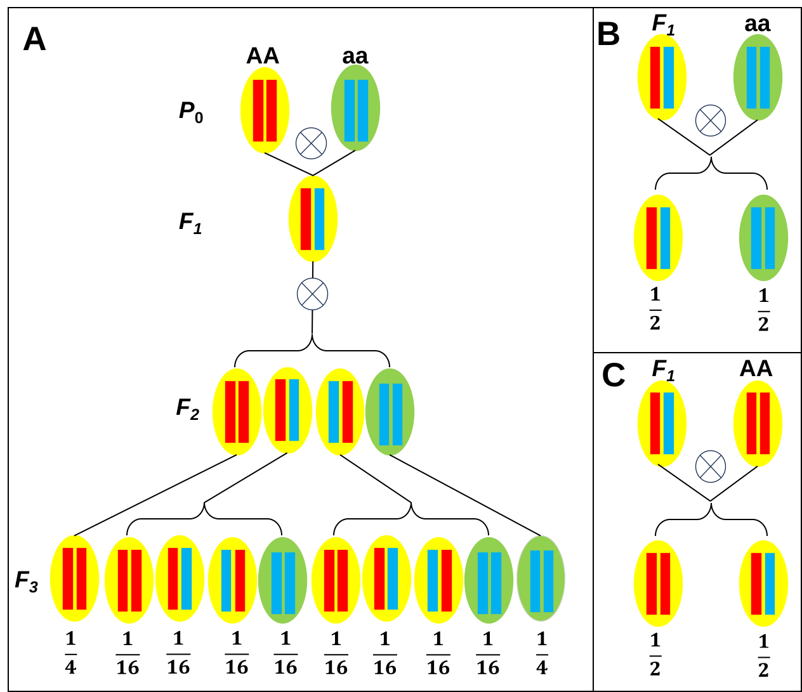
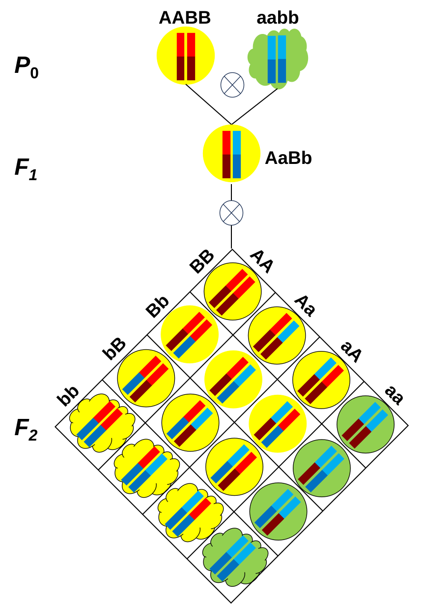

# 2.1 Mendel's Laws and Experiments

  

  &nbsp;&nbsp;&nbsp;&nbsp;Prior to the genomic era, the prevailing understanding of the laws of inheritance was largely based on hybridization experiments. This is highlighted in Morgan's seminal work, Theory of Genes, with the following statement: “The theory of modern genetics is deduced from data obtained from the hybridization of two individuals differing in one or more traits.” Mendelian genetics were also established through hybridization experiments. The two laws of inheritance proposed by Mendel are described as follows:\
  (1) The law of segregation: During the production of gametes, the pair of units (factors) of each parent separate, and only one unit is passed from a parent to an offspring.\
  (2) The law of independent assortment: Different pairs of units are passed to offspring independently of each other.
  

  

  To understand these laws, we review Mendel's experiments using the garden pea (Pisum sativum). Mendel performed hybridizations, involving the mating of two pure-breeding individuals with different traits. Pure-breeding indicates that the plant will consistently produce offspring that resemble itself. This can be achieved through self-fertilization over many generations, and such a plant is commonly referred to as homozygous today. As shown in Table 2.1, when Mendel crossed two plants that differed in a single trait, he made the following observations:\
  (1) The first filial generation (F1) comprised individuals that exhibited only one of the traits, not both;\
  (2) The phenotype of both parents appeared in the second filial generation (F2), showing a ratio of 3:1.
  

  
  Table 2.1 Mendel's seven cross experiments.
  
  |Character|Parental Cross|$F_1$ Phenotype|$F_2$ Phenotype|$F_2$ Ratio|
  |:-------:|:------------:|:-----------:|:-----------:|:-------:|
  |Seed shape|Round $\times$ Wrinkled|Round|5474R/1850W|2.96:1|
  |Seed color|Yellow $\times$ Green|Yellow|6022Y/2001G|3.01:1|
  |Flower color|Purple $\times$ White|Purple|705P/224W|3.15:1|
  |Pod shape|Inflated $\times$ Constricted|Inflated|882I/299C|2.95:1|
  |Pod color|Green $\times$ Yellow|Green|428/152Y|2.82:1|
  |Flower position|Axial $\times$ Terminal|Axial|651A/207T|3.14:1|
  |Stem length|Long $\times$ Short|long|787L/277S|2.84:1|
  
  

  To explain these findings, Mendel hypothesized that pure-breeding parents have two identical units (now known as alleles). During fertilization, a parent transfers one of these units to the offspring. This means that each offspring receives two units, one from each parent. These two units do not directly affect each other's properties. Thus, they can separate in subsequent generations. Only one of these units expresses the phenotype (the dominant allele), while the other (the recessive allele) is suppressed. Two recessive alleles are required to express the recessive phenotype. As shown in Figure 2.1A, this hypothesis does explain the 3:1 ratio observed in Mendel's experiments, but it contrasts with the 'blending' theory. To further confirm these hypotheses, Mendel observed the next generation after the second generation of hybrids, namely the F3 generation (Figure 2.1A). In the F3 generation, offspring can inherit a recessive character from F2 parents who are also recessive. However, when the F2 parents exhibit a dominant character, one third of their offspring will also exhibit a dominant character, while the remaining two thirds will be segregated. Furthermore, backcross experiments were conducted to validate the hypotheses. In a backcross between the F1 generation and a pure-breeding parent with a recessive character, half of the offspring exhibit the dominant character, while the other half exhibit the recessive character (Figure 2.1B). By contrast, all of the offspring from a backcross between the F1 generation and a pure-breeding parent with a dominant character exhibit the dominant phenotype (Figure 2.1C). These results lead to Mendel's law of segregation.
  

  
  <figure style="text-align:center;">
  
  <figcaption><b>Figure 2.1</b>. Schematic diagram of Mendel's law of segregation.</figcaption>
  </figure>
  
  

  The law of segregation pertains to the inheritance of a single feature linked to a single unit. What is the inheritance process for two characteristics associated with two different units? In order to address this issue, Mendel investigated two traits in the F2 population simultaneously. A concrete example of this is the seed color and seed shape. In a study of 556 seeds harvested from 15 plants, Mendel identified four distinct categories of pea seeds: yellow and round, yellow and wrinkled, green and round, and green and wrinkled. The frequency of each category was found to be 315, 101, 108, and 32, respectively. Consequently, the offspring of hybrids with a pair of characters correspond to a 9:3:3:1 ratio of phenotypes. Furthermore, the Mendel also found that the F2 population from the hybrids with triple characters corresponded to a 27:9:9:9:3:3:3:1 ratio of phenotypes. Based on these observations, Mendel concluded that there was no evidence of hereditary influence from one character on another. Figure 2.2 has been developed to facilitate comprehension of the law of independent assortment. It is evident that a total of two phenotypes will manifest when the units are fully interconnected.
  

  <figure style="text-align:center;">
  
  <figcaption><b>Figure 2.2</b>. Schematic diagram of Mendel's law of independent assortment.</figcaption>
  </figure>
  