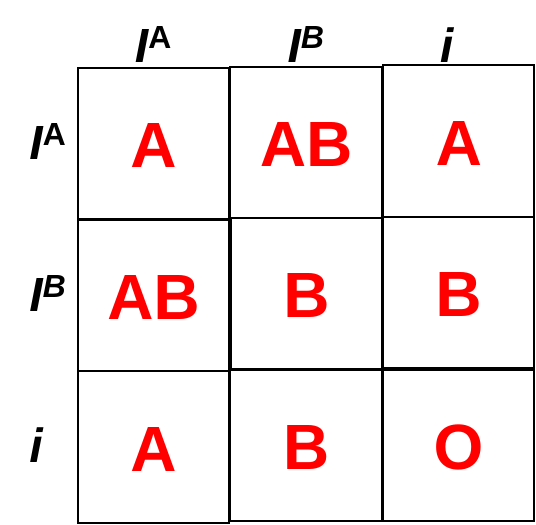

# 2.2 Extensions of the Mendel’s Laws

Mendel's laws serve as the foundational basis for the field of modern genetics. However, it is imperative to acknowledge that Mendel's theory was published in 1866. With the development spanning one and a half centuries, certain extensions of Mendel's laws have been established. 

## 2.2.1 Regard on the Dominance and Recessive

Mendel hypothesized that traits are inherited as dominant and recessive pairs in order to explain the ratio of segregations observed in his experiments. However, it is imperative to acknowledge that the heterozygote phenotype does not invariably correspond to either of the parental phenotypes, and the intermediate phenotype may emerge. To illustrate, the hybridization of snapdragons (Antirrhinum majus) from parents with white and red flowers can result in the production of pink flowers. In other words, the allele responsible for red flowers exhibits incomplete dominance over the allele associated with white flowers. The term "incompletely dominant" signifies that one of the alleles manifesting in the phenotype of a heterozygote does not entirely exclude the other. By the way, the phenomenon of intermediate flower colors in snapdragons is attributable to the dilution of pigment produced by the red allele (anthocyanin) in the heterozygote, resulting in a pink with a white background of the flower petals. In addition, the phenotypic ratio in the F2 generation is expected to be 1:2:1 for red:pink:white.

Codominance, in which both alleles for a given characteristic are co-expressed in a heterozygote, represents an example that falls outside the scope of Mendel's simple dominance and recessive hypothesis. The human ABO blood group system can be used to illustrate this point. The $I^A$ and $I^B$ alleles manifest as A or B molecules present on the surface of red blood cells. Homozygotes manifest either the A or the B phenotype, while heterozygotes express both phenotypes equally, resulting in the blood type AB. Furthermore, the human ABO blood groups offer a compelling illustration of the presence of multiple alleles within a population. With the exception of $I^A$ and $I^B$, an additional i allele exists encoding for the absence of molecules on red blood cells. Both $I^A$ and $I^B$ exhibit a dominant pattern over the $i$ allele. Notably, despite the presence of three alleles within a given population, each individual receives two of these alleles from their parents. Figure 2.3 illustrates the resulting genotypes and phenotypes. It is also noteworthy that the sex chromosomes may not be paired homologous chromosomes, thereby exhibiting divergent separation behaviors. Collectively, these considerations imply that Mendel's supposition, which postulated the presence of merely two alleles—one dominant and one recessive—may be an oversimplification.

 
<figcaption><b>Figure 2.3</b>. Inheritance of the ABO blood system in humans.</figcaption>

## 2.2.2 Regard on the Law of Independent Assortment

Despite the seven characters from Mendel's pea experiments behaving in accordance with the law of independent assortment, modern genetics has revealed that each chromosome contains hundreds or thousands of genes, with some alleles being linked. The linkage exerts a substantial influence on the process of segregation of alleles into gametes. This influence results in an increased probability of genes located in close proximity to each other on the same chromosome being inherited as a pair. However, the phenomenon of recombination suggests the possibility that two genes in proximity on the same chromosome may exhibit independent behavior, as if they are not linked. 

In order to comprehend this phenomenon, it is essential to explore the underlying biological mechanisms of gene linkage and recombination. While the specific alleles of the gene may vary between chromosome pairs, homologous chromosomes are known to possess the same genes in the same order. During the initial phases of meiosis, known as interphase and prophase I, homologous chromosomes undergo replication and subsequently form synapses, with genes on the homologs aligning in a complementary manner. At this stage, segments of homologous chromosomes exchange linear segments of genetic material. This phenomenon, known as recombination, or crossover, is a common genetic process. The genes are aligned during recombination, ensuring that the gene order remains unaltered. Instead, the outcome of recombination is the combination of maternal and paternal alleles on the same chromosome. Across a given chromosome, numerous recombination events may potentially occur, resulting in extensive shuffling of alleles. When two genes are neighbors on the same chromosome, the transmission of their alleles through meiosis occurs in a cooperative manner. However, in the event that the genes are located on different chromosomes, no recombination will take place.

To offer a more vivid illustration, let us posit that there are two genes positioned adjacent to each other on the chromosome, each corresponding to a distinct trait. One trait is characterized as tall plants and red flowers, while the other is marked by short plants and white flowers. Upon formation of the gametes, the tall and red alleles are more likely to combine into a gamete, while the short and white alleles are more likely to form other gametes. They are referred to as parental genotypes due to their intact inheritance from the parents of the individual producing gametes. However, in contrast to the scenario in which genes are located on disparate chromosomes, the presence of gametes bearing tall and white alleles, as well as gametes exhibiting short and red alleles, is not feasible. Consequently, the conventional Mendelian prediction of a 9:3:3:1 outcome in a dihybrid cross becomes invalid under these genetic conditions. As the distance between two genes increases, the probability of one or more crossovers between them increases, and the genes behave more like they are on separate chromosomes. In the chapter that addresses the development of genetic maps, we will observe the utilization of the proportion of recombinant gametes as a metric for the distance between genes on a chromosome.

