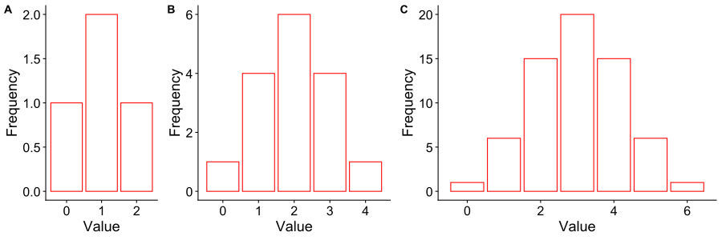
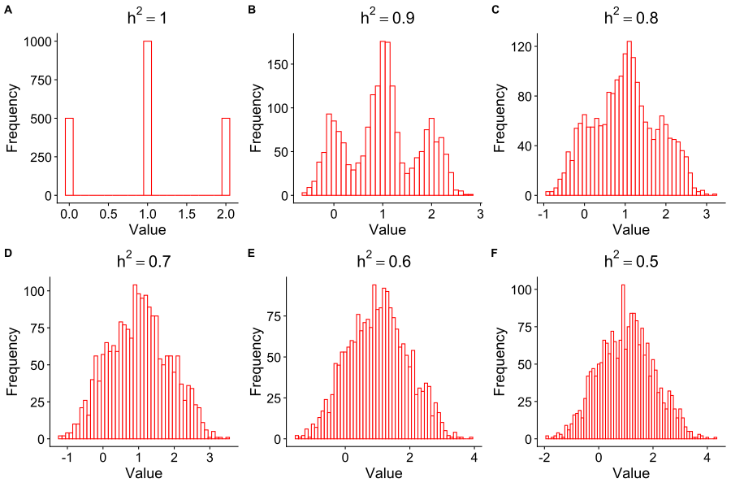

# 2.4 A Quick Look at Quantitative Traits

## 2.4.1 Polygenic Effects

The prevailing focus has been on qualitative traits. In this section, we will briefly overview some features of quantitative traits. Irrespective of the traits under investigation, the ideal expectation of the genotypic ratio would be 1AA: 2 Aa: 1AA. To facilitate comprehension, an average phenotypic value for each genotype is established as follows: $G_AA$ for AA, $G_Aa$ for Aa, and $G_aa$ for aa. Thereafter, three parameters can be defined as a function of the three genotypic values:
$$μ = \frac{1}{2}(G_{AA} + G_{aa})$$ 
$$α = G_{AA} - \frac{1}{2}(G_{AA} + G_{aa})$$
$$d = G_{aa} - \frac{1}{2}(G_{AA} + G_{aa})$$
where $μ$ represents the midpoint value, $α$ denotes the additive effect, and $d$ signifies the dominance effect. Accordingly, the three genotypic values are expressed as
$$G_{AA} = μ + α$$
$$G_{Aa} = μ + d$$
$$G_{aa} = μ - α$$
To facilitate the modeling process, the genotypic indicators are codified as follows:
$$
g_{j1} =
\begin{cases}
2 \\
1 & \text{for additive effect} \\
0
\end{cases}
$$
and 
$$
g_{j2} =
\begin{cases}
0 \\
1 & \text{for dominance effect} \\
0
\end{cases}
$$
where $j$ indexes the individual, which may correspond to the sample size $n$. Consequently, we can predict the phenotype of individuals as follows:
$$y_j = b_0 + g_{j1}b_1 + g_{j2}b_2$$
with $b_0 = μ$, $b_1 = 2α$, and $b_2 = d − α$. In order to facilitate comprehension of the polygenic effects, it is posited that there are multiple genes which exert an identical effect on the trait with $α = 1$ and $μ = d = 0$. Figure 2.4 shows the phenotypic distribution for the polygenic effects. It can be seen that the polygenic effects can lead to a normal trait distribution.

 
<figcaption><b>Figure 2.4</b>. Distribution of the trait value for one (A), two (B) and three (C) independent genes with $α = 1$ and $μ = d = 0$.</figcaption>

## 2.4.2 Eenvironmental Effects

The environmental effects can also cause a trait to exhibit a normal distribution, even under circumstances in which the trait is controlled by a single gene. In this case, the phenotype of individual j is determined by the genotype value plus an environmental error $e_j$ that follows a normal distribution $N(0, σ_e^2)$. Specifically,
$$y_j = b_0 + g_{j1}b_1 + g_{j2}b_2 + e_j$$
Assuming the same conditions, $α = 1$ and $μ = d=0$, the genetic variance can be theoretically calculated as 
$$σ_g^2 = E[g-E(g)]^2 = E(g^2) – E^2(g) = [0.25 \times 0^2 + 0.5 \times 1^2 + 0.25 \times 2^2]α^2 - [0.25 \times 0 + 0.5 \times 1 + 0.25 \times 2]^2α^2 = 0.5$$
The variance of the trait value is denoted by 
$$var(y_j) = var(g_j) + var(e_j)$$
$$σ_y^2 = σ_g^2 + σ_e^2$$
The proportion of the trait contributed by the genetic effect, termed heritability, which is given by
$$h^2 = \frac{σ_g^2}{σ_y^2} = \frac{σ_g^2}{σ_g^2 + σ_e^2} = \frac{1}{1 + 2σ_e^2}$$
Figure 2.5 illustrates the phenotypic distribution under various levels of heritability. When $h^2$ approaches 1, distinguishing among the three genotype-based distributions is possible. Conversely, the phenotype distribution becomes entirely normal when $h^2$ is small, e.g., $h^2 = 0.5$. 

 
<figcaption><b>Figure 2.5</b>. Distribution of the trait value under six different heritability. The data were simulated from 2000 individuals with $α = 1$ and $μ = d = 0$.</figcaption>

